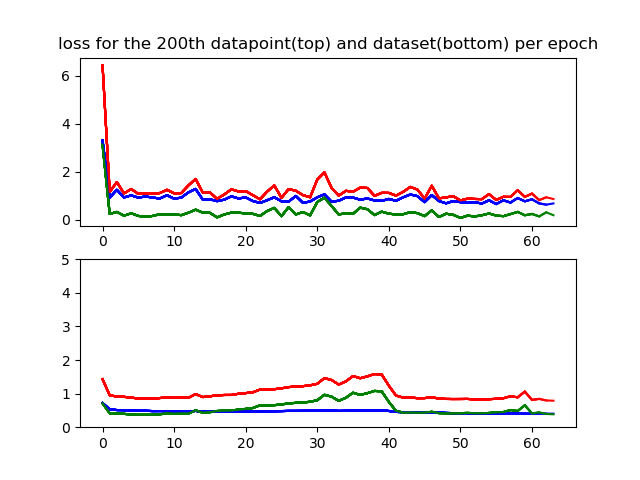
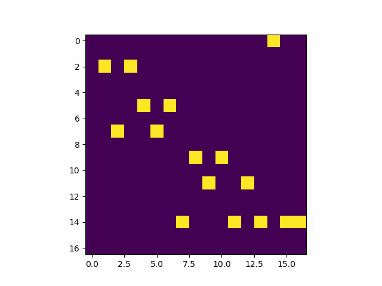
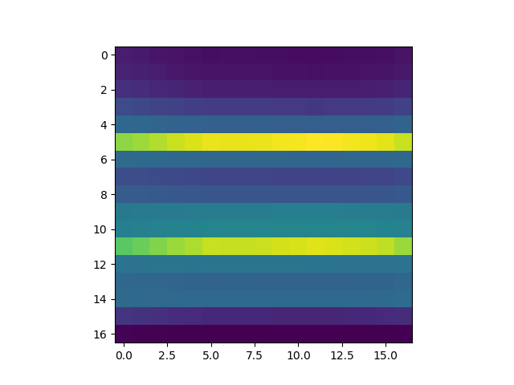
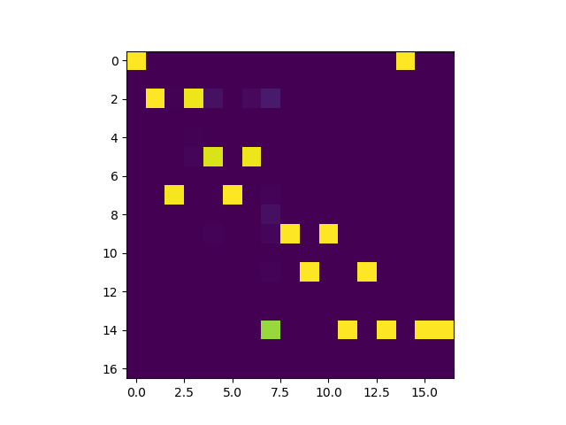

<h2 align="center">
  Neural Graph-based Dependency Parser
</h2>

In  this  paper,  we  implement  a  neural  graph-based  dependency  parser  inspired by those of Kiperwasser and Goldberg  (*Kiperwasserand  Goldberg,  2016*)  and  Dozat  and  Manning  (*Dozat  and  Manning,  2017*). We train and test our parser on the English and Hindi Treebanks  from  the  Universal  Dependencies Project,  achieving  a  UAS  of  **84.80%**  and  an LAS of **78.61%** on the English corpus, and a UAS of **91.92%** and an LAS of **83.94%** on the Hindi corpus.

### Authors

  - Jack Harding
  - Bram Kooiman
  - Akash Raj

### User guide
  - To test the datasets, navigate to src/ folder and run `python testing.py`
  - To train the datasets, navigate to src/ folder and run `python main.py`

[NOTE] - By default, the training and testing is done on english_full dataset. To train/test on other datasets, please change the path in testing.py and main.py to one of (english_full, english_short, hindi_full, hindi_short)

### Dataset
CoNLL-U files from universal-depenedencis project (for english and hindi) have been used (converted to json format). All single word occurences are converted to `<unk>`. english_short contains sentences with a maximum of 12 words. hindi_short contains sentences with a maximum of 17 words. For each sentence, we added an extra word `<ROOT>` for convenience.

### Docs
  - **data/** folder contains hindi and english datasets from [universal-dependencies project](http://universaldependencies.org/). It also contains the latest_weights (BiLSTM network weights trained with the training datasets)
  - **src/** folder contains the source code for the project.
    - main.py is used train the network
    - testing.py is used to calculate the UAS and LAS scores for test dataset
    - MST_FINAL.py contains the implementation of Chu Liu Edmonds algorithm
    - data_cleanup.py and utils.py contain utility functions for data cleanup and manipulation

### Results
Convergence of loss on the english_full dataset:

  

Heatmaps of the hindi dataset (sentence 4 with 17 words) for gold tree, and after epochs 0 and 29.

  
  
  

